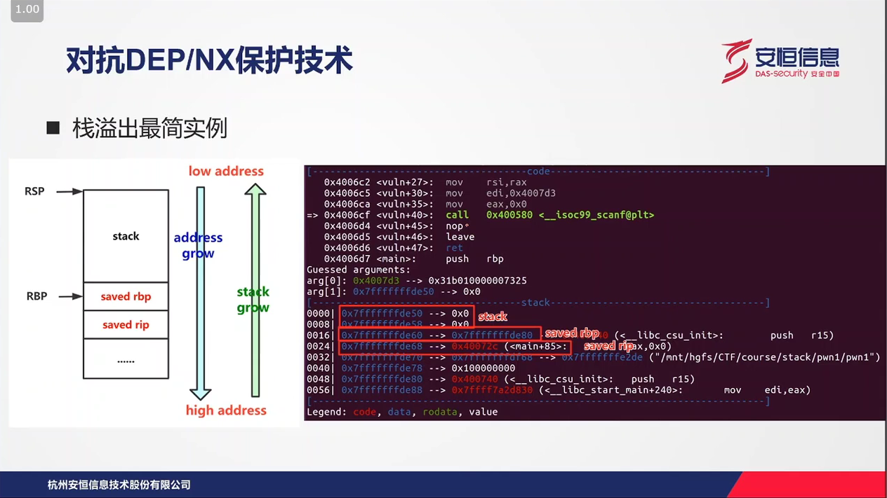
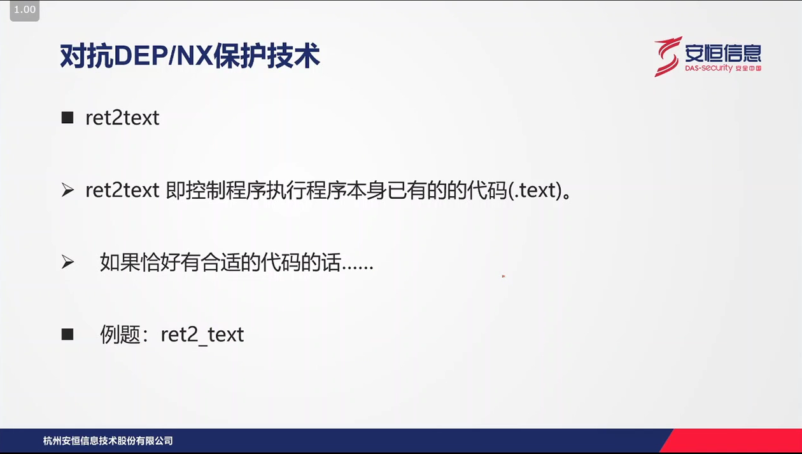
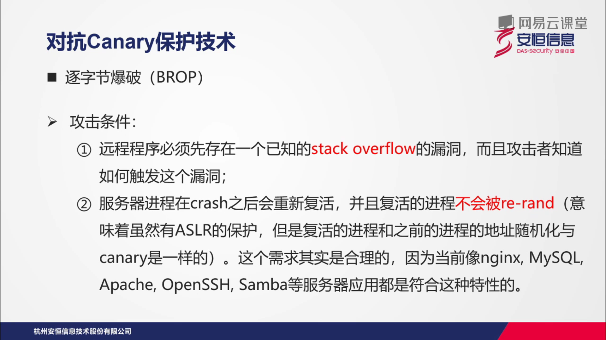
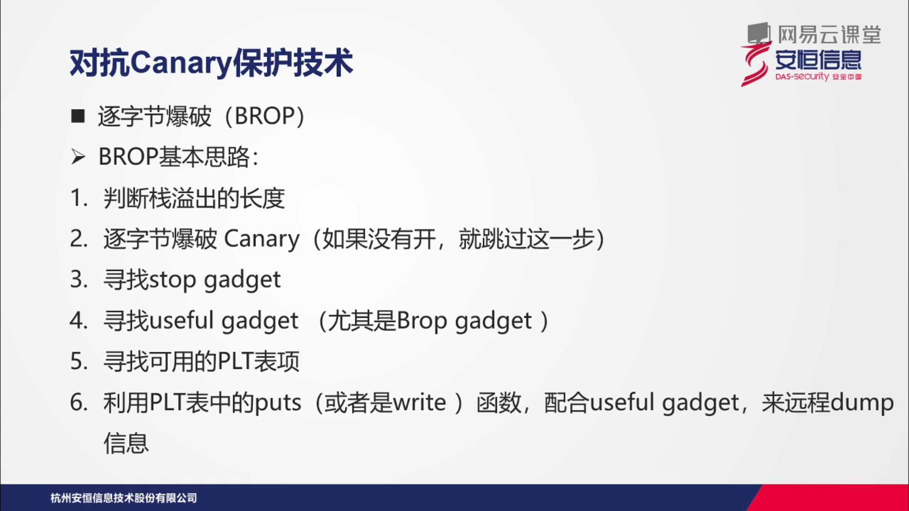

[TOC]
# 课程三：PWN-栈利用之对抗linux保护

## 3.1.Linux保护技术

### 3.1.1 NX 保护

#### 作用

​	将数据（栈，堆）所在内存页标识为不可执行，当程序成功转入shellcode时，程序会尝试在数据页面上执行指令，此时CPU就会抛出异常，而不是去执行恶意指令。

#### 编译选项

-   关闭：-z execstack
-   开启：-z noexecstack

### 3.1.2 PIE 保护

#### 作用

使得程序地址空间分布随机化，增加ROP等利用的难度。（因为地址都是不确定的了）

#### 编译选项

-    关闭： -no-pie

-    开启： -pie -fPIC

### 3.1.3  canary保护

#### 作用

​	函数开始执行的时候会先往栈里插入canary值，当函数真正返回的时候会验证canary值是否合法，如果不合法就停止程序运行。可以防止栈溢出覆盖返回地址。

#### 编译选项

-   关闭：-fno-stack-protector

-   启用（只为局部变量中含有char的函数插入保护代码）：

    -fstack-protector
-   启用（为所有函数插入保护代码）：-fstack-proctor-all

### 3.1.4 Fortify保护

#### 作用：

主要用来防止格式化字符串漏洞。包含%n的格式化字符串不能位于程序内存中的可写地址。当使用位置参数时，必须使用范围内的所有参数，如果要使用%7\$x，必须同时使用1\$2\$3\$4\$5\$6\$。

#### 编译选项

-   关闭： -D_FORTIFY_SOURCE=0

-   开启：-D_FORTIFY_SOURCE=2

### 3.1.5 RELRO保护

#### 作用

设置符号重定位表为只读，并在程序启动时就解析并绑定所有动态符号，从而对GOT表攻击。

#### 编译选项

-   开启（部分）：-z lazy

-   开启（全部）：-z now

## 3.2 对抗DEP/NX保护

## 3.3 对抗ASLR/PIE保护

## 3.4 对抗Canary保护

 

## 3.5 扩展小问题

## 3.6 格式化字符串漏洞

